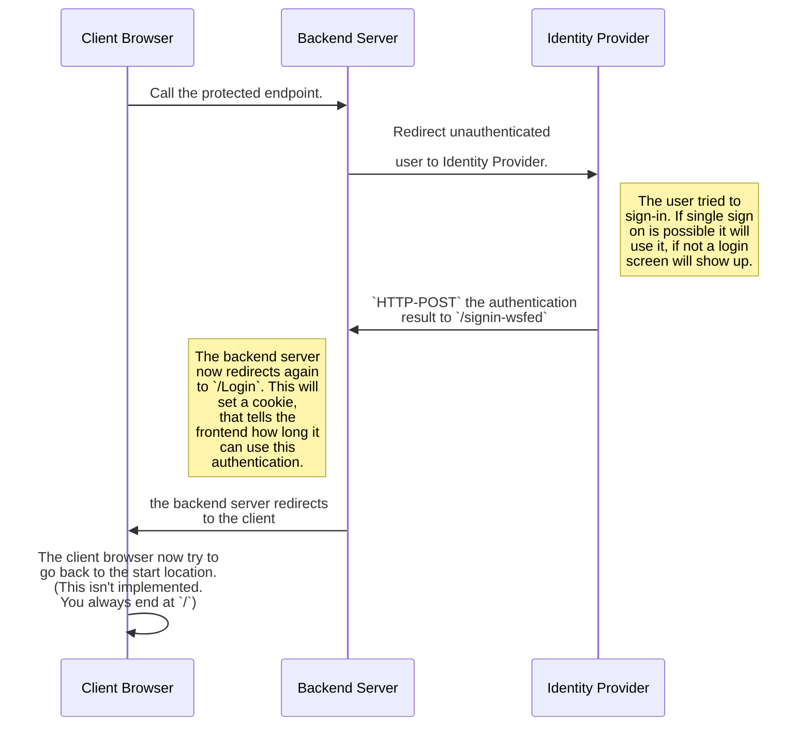

# trygithubpages

:arrow_forward:

```mermaid
sequenceDiagram
    participant Client Browser
    participant Backend Server
    participant Identity Provider
    Client Browser->>Backend Server: Call the protected endpoint.
    Backend Server->>Identity Provider: Redirect unauthenticated <br/><br/> user to Identity Provider.
    Note right of Identity Provider: The user tried to <br/> sign-in. If single sign <br/> on is possible it will <br/> use it, if not a login <br/> screen will show up.
    Identity Provider->>Backend Server: `HTTP-POST` the authentication <br/> result to `/signin-wsfed`
    Note left of Backend Server: The backend server <br/> now redirects again <br/> to `/Login`. This will <br/> set a cookie, <br/> that tells the <br/> frontend how long it <br/> can use this <br/> authentication.
    Backend Server->>Client Browser: the backend server redirects <br/> to the client
    Client Browser->>Client Browser: The client browser now try to <br/> go back to the start location. <br/> (This isn't implemented. <br/> You always end at `/`)
```
